# 🏦 Object-Oriented Banking Application

A comprehensive **Console-based Banking System** demonstrating professional **Object-Oriented Programming (OOP)** principles in Java. This educational project showcases layered architecture, design patterns, custom exception handling, and file-based persistence.

---

## 📋 Table of Contents

1. [Project Overview](#-project-overview)
2. [Features](#-features)
3. [Architecture & Design Patterns](#-architecture--design-patterns)
4. [OOP Concepts with Code Examples](#-oop-concepts-with-code-examples)
5. [Project Structure](#-project-structure)
6. [Detailed Workflows](#-detailed-workflows)
7. [Key Design Decisions](#-key-design-decisions)
8. [Exception Handling](#-exception-handling)
9. [Data Persistence](#-data-persistence)
10. [Setup & Usage](#-setup--usage)
11. [Sample Interactions](#-sample-interactions)
12. [Extension Points](#-extension-points)

---

## 🎯 Project Overview

### Purpose
This banking application is designed as an **educational project** for learning and demonstrating:
- Core OOP principles (Encapsulation, Abstraction, Inheritance, Polymorphism)
- Professional software architecture patterns
- Clean code organization and separation of concerns
- Real-world banking domain modeling

### Target Audience
- Students learning Object-Oriented Programming
- Java developers wanting to understand layered architecture
- Anyone interested in real-world application of OOP concepts

### Technology Stack
- **Language**: Java SE (Standard Edition)
- **Data Storage**: File-based persistence using Java Serialization
- **Interface**: Console-based (CLI)
- **Design**: Layered architecture with Repository and Service patterns

---

## ✨ Features

### Account Management
- ✅ **Multiple Account Types**
  - Savings Account (with minimum balance requirement)
  - Current Account (with overdraft facility)
  - Fixed Deposit Account (with maturity date and higher interest)

### Banking Operations
- 💰 **Deposit Money** - Add funds to any account
- 💸 **Withdraw Money** - Withdraw with account-specific validations
- 🔄 **Transfer Funds** - Move money between accounts
- 📈 **Interest Calculation** - Apply interest based on account type
- 📊 **Transaction History** - View last N transactions for any account
- 📄 **Bank Summary Report** - View all accounts and total bank balance

### Technical Features
- 🔐 **Type-Safe Operations** - Using Enums for account and transaction types
- 💾 **Persistent Storage** - Data saved to disk using Java Serialization
- ⚠️ **Custom Exception Handling** - Meaningful error messages
- 🏗️ **Extensible Design** - Easy to add new account types or features

---

## 🏗️ Architecture & Design Patterns

### Layered Architecture

The application follows a **3-tier layered architecture** for separation of concerns:

```mermaid
flowchart TD
    A[🖥️ Presentation Layer<br/>BankingApp.java] --> B[🧠 Service Layer<br/>BankService]
    B --> C[💾 Repository Layer<br/>AccountRepository]
    C --> D[(📁 File Storage<br/>accounts.ser)]
    
    B --> E[📦 Model Layer<br/>Account, Transaction]
    E --> C
    
    style A fill:#e1f5ff
    style B fill:#fff4e1
    style C fill:#f0e1ff
    style D fill:#e1ffe1
    style E fill:#ffe1e1
```



### Design Patterns Implemented

#### 1. **Repository Pattern**
**Purpose**: Abstracts data access logic from business logic.

```java
public interface AccountRepository {
    void saveAll(List<Account> accounts);
    Account findAccount(String accountNumber);
    void addAccount(Account account);
}
```

**Benefit**: We can switch from `FileAccountRepository` to `DatabaseAccountRepository` without changing service code.

#### 2. **Factory Pattern**
**Purpose**: Centralized object creation logic.

```java
// In BankServiceImpl.java
private String generateAccountNumber(AccountType type) {
    return type.getCode() + System.currentTimeMillis() % 1000000;
}

public void createAccount(String holderName, String aadhaar, AccountType type, ...) {
    String accNum = generateAccountNumber(type);
    Account account;
    switch (type) {
        case SAVINGS -> account = new SavingsAccount(...);
        case CURRENT -> account = new CurrentAccount(...);
        case FIXED_DEPOSIT -> account = new FixedDepositAccount(...);
    }
    accountRepository.addAccount(account);
}
```

#### 3. **Template Method Pattern**
**Purpose**: Define skeleton of algorithm in base class, let subclasses fill in details.

The `Account` abstract class defines the template, and subclasses implement specific behaviors.

#### 4. **Strategy Pattern**
**Purpose**: Different withdrawal strategies for different account types.

Each account class implements its own `withdraw()` logic based on business rules.

---

## 💡 OOP Concepts with Code Examples

### 1. Encapsulation (Data Hiding)

**Concept**: Restricting direct access to object's internal state and protecting data integrity.

**Implementation in Account.java**:

```java
public abstract class Account implements Serializable {
    // Private fields - cannot be accessed directly from outside
    protected String accountNumber;
    protected String holderName;
    protected double balance;  // ❌ Cannot do: account.balance = -1000
    protected List<Transaction> transactions;
    
    // Public getter - controlled read access
    public double getBalance() {
        return balance;  // ✅ Read-only access
    }
    
    // Controlled modification through method with validation
    public void deposit(double amount, String description) {
        if (amount > 0 && isActive) {  // ✅ Validation before modification
            balance += amount;
            transactions.add(new Transaction(...));
        }
    }
}
```

**Why This Matters**:
- ❌ **Without Encapsulation**: `account.balance = -5000;` (Invalid state!)
- ✅ **With Encapsulation**: Must use `deposit()` or `withdraw()` which validate the operation

---

### 2. Abstraction (Hiding Complexity)

**Concept**: Hiding implementation details and exposing only essential features.

**Abstract Class - Account.java**:

```java
public abstract class Account implements Serializable {
    // Common properties all accounts share
    protected String accountNumber;
    protected double balance;
    
    // ✅ Concrete method - same for all account types
    public void deposit(double amount, String description) {
        balance += amount;
        transactions.add(new Transaction(...));
    }
    
    // ❌ Abstract methods - each account type implements differently
    public abstract boolean withdraw(double amount, String description) 
        throws InsufficientFundsException;
    
    public abstract void calculateInterest();
}
```

**Why `withdraw()` is Abstract**:
- **Savings**: Must maintain minimum balance (₹1,000)
- **Current**: Can go negative using overdraft
- **Fixed Deposit**: Can only withdraw after maturity date

**Interface - BankService.java**:

```java
public interface BankService {
    void createAccount(String holderName, String aadhaar, AccountType type, ...);
    void deposit(String accountNumber, double amount, String description);
    void withdraw(String accountNumber, double amount, String description);
    void transfer(String fromAccount, String toAccount, double amount, ...);
    String generateSummaryReport();
}
```

**Benefit**: The `BankingApp` (main class) doesn't need to know *how* these operations work internally. It just calls the methods.

---

### 3. Inheritance (Code Reusability)

**Concept**: Child classes inherit properties and behaviors from parent class.

**Inheritance Hierarchy**:


**Code Example - SavingsAccount.java**:

```java
public class SavingsAccount extends Account {  // ✅ Inherits from Account
    private static final double INTEREST_RATE = 0.04;
    private int minBalance = 1000;
    
    public SavingsAccount(String accountNumber, String holderName, 
                         String holderAadhaar, double initialBalance) {
        super(accountNumber, holderName, holderAadhaar, initialBalance, 
              AccountType.SAVINGS);  // ✅ Calls parent constructor
    }
    
    // ✅ Inherits deposit() method from Account - no need to rewrite!
    // ✅ Inherits getBalance(), getTransactions() etc.
    
    // ❌ Must provide own implementation of abstract method
    @Override
    public boolean withdraw(double amount, String description) 
        throws InsufficientFundsException {
        if (balance - amount < minBalance) {
            throw new InsufficientFundsException(
                "Minimum balance ₹" + minBalance + " required");
        }
        balance -= amount;  // ✅ Can access 'protected' parent field
        transactions.add(new Transaction(...));
        return true;
    }
}
```

**Benefits Demonstrated**:
- No need to rewrite `deposit()`, `getBalance()`, or transaction logging
- Shared fields (`balance`, `transactions`) defined once in parent
- Only account-specific logic needs to be implemented

---

### 4. Polymorphism (Many Forms)

**Concept**: Same method call produces different behaviors based on object type at runtime.

**The Power of Polymorphism - All Three withdraw() Methods**:

#### Savings Account - Minimum Balance Check
```java
public class SavingsAccount extends Account {
    @Override
    public boolean withdraw(double amount, String description) 
        throws InsufficientFundsException {
        if (balance - amount < minBalance) {  // ✅ Savings-specific rule
            throw new InsufficientFundsException(
                "Minimum balance ₹" + minBalance + " required");
        }
        balance -= amount;
        return true;
    }
}
```

#### Current Account - Overdraft Support
```java
public class CurrentAccount extends Account {
    private double overdraftLimit;
    
    @Override
    public boolean withdraw(double amount, String description) 
        throws InsufficientFundsException {
        double availableBalance = balance + overdraftLimit;  // ✅ Can go negative!
        if (availableBalance < amount) {
            throw new InsufficientFundsException(
                "Insufficient funds. Available: ₹" + availableBalance);
        }
        balance -= amount;
        return true;
    }
}
```

#### Fixed Deposit - Maturity Date Check
```java
public class FixedDepositAccount extends Account {
    private LocalDateTime maturityDate;
    
    @Override
    public boolean withdraw(double amount, String description) 
        throws InsufficientFundsException {
        if (LocalDateTime.now().isBefore(maturityDate)) {  // ✅ FD-specific rule
            throw new InsufficientFundsException(
                "FD not matured yet. Maturity: " + maturityDate);
        }
        if (balance < amount) {
            throw new InsufficientFundsException("Insufficient funds in FD");
        }
        balance -= amount;
        return true;
    }
}
```

**Polymorphism in Action (BankServiceImpl.java)**:

```java
public void withdraw(String accountNumber, double amount, String description) 
    throws Exception {
    Account acc = accountRepository.findAccount(accountNumber);
    
    // ✅ Polymorphic call - Java determines which withdraw() to call at runtime
    // Based on actual object type (SavingsAccount, CurrentAccount, or FDAccount)
    acc.withdraw(amount, description);
}
```

**Runtime Behavior**:
- If `acc` is a `SavingsAccount` → checks minimum balance
- If `acc` is a `CurrentAccount` → checks overdraft limit
- If `acc` is a `FixedDepositAccount` → checks maturity date

**Same method call, different behaviors!** 🎭

---

### 5. Interfaces (Contracts)

**Concept**: Define "what" must be done, not "how" to do it. Provides loose coupling.

**AccountRepository Interface**:

```java
public interface AccountRepository {
    void saveAll(List<Account> accounts);
    List<Account> loadAll();
    void addAccount(Account account);
    Account findAccount(String accountNumber) throws AccountNotFoundException;
    List<Account> getAllAccounts();
}
```

**Implementation - FileAccountRepository**:

```java
public class FileAccountRepository implements AccountRepository {
    private List<Account> accounts;
    private String filename;
    
    @Override
    public void saveAll(List<Account> accounts) {
        try (ObjectOutputStream oos = new ObjectOutputStream(
                new FileOutputStream(filename))) {
            oos.writeObject(accounts);
        } catch (IOException e) {
            System.err.println("Save failed: " + e.getMessage());
        }
    }
    
    @Override
    public Account findAccount(String accountNumber) 
        throws AccountNotFoundException {
        return accounts.stream()
            .filter(acc -> acc.getAccountNumber().equals(accountNumber))
            .findFirst()
            .orElseThrow(() -> new AccountNotFoundException(accountNumber));
    }
}
```

**Benefits of Interface**:
1. **Dependency Injection**: `BankServiceImpl` depends on interface, not concrete class
   ```java
   public class BankServiceImpl implements BankService {
       private AccountRepository accountRepository;  // ✅ Interface type
       
       public BankServiceImpl(AccountRepository accountRepository, ...) {
           this.accountRepository = accountRepository;  // ✅ Inject any implementation
       }
   }
   ```

2. **Easy to Swap Implementations**:
   ```java
   // Currently using file storage
   AccountRepository repo = new FileAccountRepository("accounts.ser");
   
   // Future: Switch to database - NO changes to BankServiceImpl!
   AccountRepository repo = new DatabaseAccountRepository("jdbc:...");
   ```

---

## 📁 Project Structure

```
com.banking/
│
├── 📂 exception/
│   ├── AccountNotFoundException.java      # Thrown when account not found
│   └── InsufficientFundsException.java   # Thrown on invalid withdrawal
│
├── 📂 main/
│   └── BankingApp.java                   # Entry point, user interface (CLI)
│
├── 📂 model/
│   ├── Account.java                      # Abstract base class for all accounts
│   ├── AccountType.java                  # Enum: SAVINGS, CURRENT, FIXED_DEPOSIT
│   ├── SavingsAccount.java              # Minimum balance requirement
│   ├── CurrentAccount.java              # Overdraft facility
│   ├── FixedDepositAccount.java         # Maturity date validation
│   ├── Transaction.java                  # Records each transaction
│   └── TransactionType.java             # Enum: DEPOSIT, WITHDRAWAL, TRANSFER, etc.
│
├── 📂 repository/
│   ├── AccountRepository.java            # Interface for data access
│   └── FileAccountRepository.java       # File-based persistence implementation
│
└── 📂 service/
    ├── BankService.java                  # Interface for business operations
    └── BankServiceImpl.java             # Business logic implementation

📄 accounts.ser                           # Binary file storing serialized accounts
```

### Component Responsibilities

| Component | Responsibility |
|-----------|---------------|
| **BankingApp** | User interaction, menu display, input collection |
| **BankService** | Business logic orchestration, transaction coordination |
| **AccountRepository** | Data persistence and retrieval |
| **Account (Models)** | Domain objects with validation rules |
| **Exceptions** | Error handling and meaningful error messages |

---

## 🔄 Detailed Workflows

### Workflow 1: Creating an Account

**Step-by-step Flow**:



```mermaid
sequenceDiagram
    participant User
    participant BankingApp
    participant BankService
    participant Factory
    participant Repository
    
    User->>BankingApp: Enter name, aadhaar, type, amount
    BankingApp->>BankService: createAccount(name, aadhaar, SAVINGS, 5000)
    BankService->>Factory: generateAccountNumber(SAVINGS)
    Factory-->>BankService: "SAV123456"
    BankService->>BankService: new SavingsAccount("SAV123456", ...)
    BankService->>Repository: addAccount(savingsAccount)
    Repository-->>BankService: Account added
    BankService-->>User: ✅ Account created successfully
```

**Code Flow (BankServiceImpl.java)**:

```java
@Override
public void createAccount(String holderName, String aadhaar, AccountType type,
                         double initialDeposit, Double... extraParams) {
    // Step 1: Generate unique account number
    String accNum = generateAccountNumber(type);  // e.g., "SAV847362"
    
    // Step 2: Factory pattern - create appropriate account type
    Account account;
    switch (type) {
        case SAVINGS:
            account = new SavingsAccount(accNum, holderName, aadhaar, initialDeposit);
            break;
        case CURRENT:
            account = new CurrentAccount(accNum, holderName, aadhaar, 
                                        initialDeposit, extraParams[0]);  // overdraft
            break;
        case FIXED_DEPOSIT:
            account = new FixedDepositAccount(accNum, holderName, aadhaar, 
                                             initialDeposit, 
                                             extraParams[0].intValue(),  // tenure
                                             extraParams[1]);  // interest rate
            break;
    }
    
    // Step 3: Store in repository
    accountRepository.addAccount(account);
    
    // Step 4: Confirm to user
    System.out.println("✅ Account created: " + account);
}
```

---

### Workflow 2: Money Transfer (Polymorphism in Action)

**Step-by-step Flow**:


**Code (BankServiceImpl.java)**:

```java
@Override
public void transfer(String fromAccount, String toAccount, 
                    double amount, String description) throws Exception {
    // Step 1: Find both accounts
    Account from = accountRepository.findAccount(fromAccount);
    Account to = accountRepository.findAccount(toAccount);
    
    // Step 2: Attempt withdrawal (polymorphic - different logic per account type)
    if (from.withdraw(amount, description + " to " + to.getAccountNumber())) {
        // Step 3: If successful, deposit to recipient
        to.deposit(amount, description + " from " + from.getAccountNumber());
    }
}
```

**What Makes This Polymorphic**:
- `from.withdraw()` could call `SavingsAccount.withdraw()`, `CurrentAccount.withdraw()`, or `FixedDepositAccount.withdraw()`
- Java determines the actual method at **runtime** based on the object type
- Service layer doesn't need to know which type it is!

---

### Workflow 3: Interest Calculation

**How Different Account Types Calculate Interest**:

```java
// SAVINGS: 4% annual interest (monthly calculation)
@Override
public void calculateInterest() {
    double interest = balance * INTEREST_RATE / 12;  // Monthly interest
    deposit(interest, "Monthly Interest");
}

// CURRENT: No interest
@Override
public void calculateInterest() {
    // No interest for current accounts
}

// FIXED DEPOSIT: Custom rate, only after maturity
@Override
public void calculateInterest() {
    if (LocalDateTime.now().isAfter(maturityDate)) {
        double interest = balance * interestRate * 1;  // Simple interest
        deposit(interest, "FD Maturity Interest");
    }
}
```

---

## 🎯 Key Design Decisions

### Why is `Account` Abstract?

> **Decision**: Make `Account` an abstract class instead of concrete.

**Rationale**:
- A generic "Account" shouldn't exist on its own in the real world
- Forces proper classification (Savings, Current, or FD)
- Ensures all accounts implement required behaviors (`withdraw`, `calculateInterest`)

**Code Evidence**:
```java
// ❌ This should NOT be allowed:
Account acc = new Account(...);  // Compilation error!

// ✅ This is correct:
Account acc = new SavingsAccount(...);  // Specific type
```

---

### Why is `balance` Protected, Not Private?

> **Decision**: Use `protected` modifier for `balance`, `accountNumber`, etc.

**Rationale**:
```java
public abstract class Account {
    protected double balance;  // ✅ Child classes can access
}

public class SavingsAccount extends Account {
    public boolean withdraw(double amount, ...) {
        balance -= amount;  // ✅ Direct access allowed
        // If 'balance' was private, we'd need: setBalance(getBalance() - amount) ❌
    }
}
```

**Benefit**: Child classes can directly modify balance while still preventing external access.

---

### Why Use Enums for Types?

> **Decision**: Use `enum` for `AccountType` and `TransactionType`.

**Without Enum (Error-Prone)**:
```java
String accountType = "Savigns";  // ❌ Typo! Will cause runtime bug
```

**With Enum (Type-Safe)**:
```java
AccountType type = AccountType.SAVINGS;  // ✅ Compile-time safety
// AccountType type = AccountType.SAVIGNS;  // ❌ Compilation error!
```

**Enum Definition**:
```java
public enum AccountType {
    SAVINGS("SAV"), 
    CURRENT("CUR"), 
    FIXED_DEPOSIT("FD");
    
    private String code;
    
    AccountType(String code) {
        this.code = code;
    }
    
    public String getCode() {
        return code;  // Used in account number: "SAV123456"
    }
}
```

---

### Why Repository Pattern for File I/O?

> **Decision**: Abstract file operations behind `AccountRepository` interface.

**Benefit**: Swap storage mechanism without touching business logic.

```java
// Current: File-based storage
AccountRepository repo = new FileAccountRepository("accounts.ser");
BankService service = new BankServiceImpl(repo, "INDIAN BANK", "INDI0000001");

// Future: Database storage (NO changes to BankServiceImpl!)
AccountRepository repo = new DatabaseAccountRepository("jdbc:mysql://...");
BankService service = new BankServiceImpl(repo, "INDIAN BANK", "INDI0000001");
```

---

## ⚠️ Exception Handling

### Custom Exceptions

#### 1. AccountNotFoundException
**When**: Account number doesn't exist in repository.

```java
public class AccountNotFoundException extends Exception {
    public AccountNotFoundException(String accountNumber) {
        super("Account not found: " + accountNumber);
    }
}
```

**Usage**:
```java
public Account findAccount(String accountNumber) throws AccountNotFoundException {
    return accounts.stream()
        .filter(acc -> acc.getAccountNumber().equals(accountNumber))
        .findFirst()
        .orElseThrow(() -> new AccountNotFoundException(accountNumber));
}
```

#### 2. InsufficientFundsException
**When**: Withdrawal would violate account rules.

```java
public class InsufficientFundsException extends Exception {
    public InsufficientFundsException(String message) {
        super(message);
    }
}
```

**Usage Examples**:
```java
// Savings: "Minimum balance ₹1000 required"
throw new InsufficientFundsException("Minimum balance ₹" + minBalance + " required");

// Current: "Insufficient funds. Available: ₹15000"
throw new InsufficientFundsException("Insufficient funds. Available: ₹" + availableBalance);

// FD: "FD not matured yet. Maturity: 2026-06-15"
throw new InsufficientFundsException("FD not matured yet. Maturity: " + maturityDate);
```

### Exception Handling Strategy

**Layered Exception Handling**:

```java
// Layer 1: Model throws specific exceptions
public boolean withdraw(double amount, ...) throws InsufficientFundsException {
    if (balance - amount < minBalance) {
        throw new InsufficientFundsException(...);  // ❌ Problem detected
    }
}

// Layer 2: Service propagates exceptions
public void withdraw(String accountNumber, ...) throws Exception {
    Account acc = accountRepository.findAccount(accountNumber);  // May throw
    acc.withdraw(amount, description);  // May throw
}

// Layer 3: Presentation catches and displays user-friendly message
try {
    bankService.withdraw(accNum, amount, "Manual Withdrawal");
    System.out.println("✅ Transaction Successful");
} catch (Exception e) {
    System.out.println("❌ " + e.getMessage());  // User sees: "Minimum balance ₹1000 required"
}
```

---

## 💾 Data Persistence

### Java Serialization Explained

**What is Serialization?**
Converting an object's state into a byte stream to save to a file (or send over network).

**Why `Serializable` Interface?**
```java
public abstract class Account implements Serializable {
    private static final long serialVersionUID = 1L;  // Version control
    // ...
}
```

- **Marker Interface**: Tells Java this class can be serialized
- **serialVersionUID**: Ensures compatibility when loading saved data

### Saving Data (FileAccountRepository.java)

```java
public void saveToDisk() {
    try (ObjectOutputStream oos = new ObjectOutputStream(
            new FileOutputStream(filename))) {
        // ✅ Serializes entire List<Account> to binary file
        oos.writeObject(accounts);
        System.out.println("💾 Data saved to " + filename);
    } catch (IOException e) {
        System.err.println("❌ Save failed: " + e.getMessage());
    }
}
```

### Loading Data (FileAccountRepository.java)

```java
@SuppressWarnings("unchecked")
public List<Account> loadAll() {
    try (ObjectInputStream ois = new ObjectInputStream(
            new FileInputStream(filename))) {
        // ✅ Deserializes binary file back to List<Account>
        List<Account> loadedAccounts = (List<Account>) ois.readObject();
        if (loadedAccounts != null) {
            return loadedAccounts;
        }
    } catch (Exception e) {
        // File not found or empty - return new list
    }
    return new ArrayList<>();
}
```

**File Format**: `accounts.ser` is a **binary file** (not human-readable).

**Data Flow**:
1. **On Startup**: `loadAll()` reads `accounts.ser` and reconstructs all `Account` objects
2. **During Operations**: Changes made in memory (List<Account>)
3. **On Exit**: `saveAll()` writes entire list back to `accounts.ser`

---

## 🚀 Setup & Usage

### Prerequisites
- **Java Development Kit (JDK)** 11 or higher
- Command line access (PowerShell, CMD, or Terminal)

### Compilation

**Step 1**: Navigate to the project directory:
```powershell
cd "c:\Users\V\Documents\HCL-training\99220040593-Day-2\Banking Application"
```

**Step 2**: Compile all Java files:
```powershell
javac com\banking\main\BankingApp.java
```

This will automatically compile all dependent classes.

### Running the Application

```powershell
java com.banking.main.BankingApp
```

### Resetting Data

To start fresh (delete all accounts):
```powershell
Remove-Item accounts.ser
```

---

## 🎮 Sample Interactions

### Creating Accounts

```
🏦 Welcome to Abstracted Banking System!

📋 MENU:
1. Create Account
2. Deposit
3. Withdraw
4. Transfer
5. Apply Interest
6. Bank Summary
7. Transactions
8. Save & Exit
👉 Choose: 1

Name: Rajesh Kumar
Aadhaar: 1234-5678-9012
Initial Deposit: ₹5000
Account Type: 1-Savings 2-Current 3-FD
1
✅ Account created: SAV847362 | Rajesh Kumar | SAV | ₹5000.00 | Active
```

### Deposit Operation

```
👉 Choose: 2
Account Number: SAV847362
Deposit amount: ₹3000
✅ Transaction Successful
```

### Withdrawal with Error Handling

```
👉 Choose: 3
Account Number: SAV847362
Withdraw amount: ₹7500
❌ Minimum balance ₹1000 required
```

### Successful Transfer

```
👉 Choose: 4
From Account: SAV847362
To Account: CUR923847
Amount: ₹2000
✅ Transfer successful!
```

### Bank Summary Report

```
👉 Choose: 6

🏦 INDIAN BANK - IFSC: INDI0000001
Total Accounts: 3
Total Balance: ₹45000.50

SAV847362 | Rajesh Kumar | SAV | ₹5500.00 | Active
CUR923847 | Priya Sharma | CUR | ₹12500.00 | Active
FD123456 | Amit Patel | FD | ₹27000.50 | Active
```

### Transaction History

```
👉 Choose: 7
Account Number: SAV847362

📊 Last 10 Transactions:
[2026-02-03 16:14:23] TRANSFER | -₹2000.00 | Balance: ₹5500.00 | Fund Transfer to CUR923847
[2026-02-03 16:12:15] DEPOSIT | +₹3000.00 | Balance: ₹7500.00 | Manual Deposit
[2026-02-03 16:10:45] DEPOSIT | +₹5000.00 | Balance: ₹5000.00 | Account Opening
```

---

## 🔧 Extension Points

### How to Add a New Account Type (e.g., Loan Account)

**Step 1**: Add to `AccountType` enum:
```java
public enum AccountType {
    SAVINGS("SAV"), 
    CURRENT("CUR"), 
    FIXED_DEPOSIT("FD"),
    LOAN("LOAN");  // ✅ New type
    // ...
}
```

**Step 2**: Create `LoanAccount.java`:
```java
public class LoanAccount extends Account {
    private double loanAmount;
    private double interestRate;
    
    @Override
    public boolean withdraw(double amount, String description) {
        // Loan logic: Cannot withdraw, only repay
        throw new UnsupportedOperationException("Cannot withdraw from loan account");
    }
    
    @Override
    public void calculateInterest() {
        double interest = loanAmount * interestRate / 12;
        // Add interest to outstanding amount
    }
}
```

**Step 3**: Update `BankServiceImpl.createAccount()`:
```java
switch (type) {
    case SAVINGS -> account = new SavingsAccount(...);
    case CURRENT -> account = new CurrentAccount(...);
    case FIXED_DEPOSIT -> account = new FixedDepositAccount(...);
    case LOAN -> account = new LoanAccount(...);  // ✅ New case
}
```

**That's it!** No changes needed to Repository or UI code.

---

### Switching from File to Database

**Step 1**: Create `DatabaseAccountRepository.java`:
```java
public class DatabaseAccountRepository implements AccountRepository {
    private Connection connection;
    
    public DatabaseAccountRepository(String jdbcUrl) {
        // Initialize database connection
    }
    
    @Override
    public Account findAccount(String accountNumber) {
        // SQL: SELECT * FROM accounts WHERE account_number = ?
    }
    
    @Override
    public void saveAll(List<Account> accounts) {
        // SQL: INSERT/UPDATE statements
    }
}
```

**Step 2**: Change initialization in `BankingApp.java`:
```java
// Old:
AccountRepository repository = new FileAccountRepository("accounts.ser");

// New:
AccountRepository repository = new DatabaseAccountRepository("jdbc:mysql://localhost/banking");
```

**No other code changes needed!** That's the power of the Repository Pattern.

---

## 📚 Learning Outcomes

After studying this project, you should understand:

✅ **OOP Principles**:
- Encapsulation: Protecting data integrity
- Abstraction: Hiding complexity
- Inheritance: Code reuse and hierarchies
- Polymorphism: Runtime behavior selection
- Interfaces: Contracts and loose coupling

✅ **Design Patterns**:
- Repository Pattern for data access
- Factory Pattern for object creation
- Template Method for algorithm skeletons
- Strategy Pattern for varying behaviors

✅ **Software Architecture**:
- Layered architecture (Presentation, Service, Repository, Model)
- Separation of concerns
- Dependency injection

✅ **Java Concepts**:
- Abstract classes and methods
- Interfaces and implementation
- Enums for type safety
- Exception handling strategies
- Object serialization for persistence

---

## 📝 License

This project is for **educational purposes**. Feel free to use and modify for learning.

---

## 👨‍💻 Author

Created as a comprehensive learning resource for Object-Oriented Programming in Java.

**Project**: Banking Application with OOP Concepts  
**Language**: Java SE  
**Architecture**: Layered (MVC-inspired)  
**Storage**: File-based persistence using Java Serialization

---

**🎓 Happy Learning!** If you have questions or suggestions, feel free to reach out.
