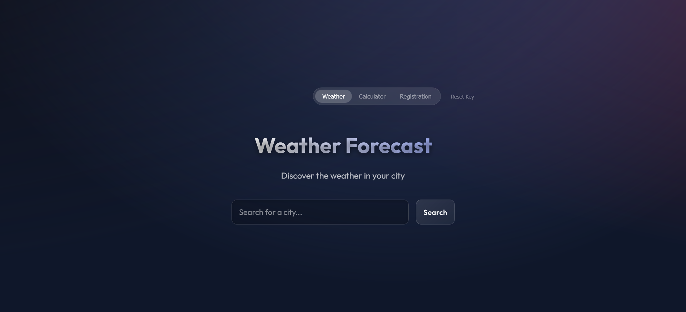

# All-in-One React Application 🌟

A stunning, modern React application that combines three powerful features into one seamless experience: **Weather Forecasting**, **Calculator**, and **Student Registration**. Built with React 19, Vite, and featuring a beautiful glassmorphism design with smooth animations.



## ✨ Features

### 🌤️ Weather Forecast
Get real-time weather information for any city around the world using the Weatherstack API.

**Key Capabilities:**
- **Live Weather Data**: Search any city and get instant weather updates
- **Comprehensive Information**: View temperature, weather conditions, humidity, wind speed, atmospheric pressure, and UV index
- **Beautiful Weather Cards**: Glassmorphic design with smooth fade-in animations
- **Secure API Key Management**: Your Weatherstack API key is safely stored in browser's local storage
- **Error Handling**: Graceful error messages for invalid cities or API issues


### 🧮 Calculator
A fully functional calculator with a sleek, modern interface.

**Key Capabilities:**
- **Basic Operations**: Addition, subtraction, multiplication, and division
- **Glassmorphism Design**: Beautiful translucent interface with backdrop blur effects
- **Responsive Buttons**: Smooth hover effects and transitions
- **Clear Display**: Easy-to-read digital display with proper formatting
- **Keyboard Support**: Works seamlessly with mouse clicks


### 📝 Student Registration Form
A comprehensive registration form with real-time validation and user feedback.

**Key Capabilities:**
- **Complete Form Fields**: Full name, email, phone number, date of birth, and gender
- **Real-time Validation**: Instant feedback on input validity
- **Visual Indicators**: Success/error icons for each field
- **Email Validation**: Proper email format checking
- **Phone Number Formatting**: Validates phone number patterns
- **Date Picker**: User-friendly date selection for birth date
- **Responsive Design**: Works perfectly on all screen sizes


## 🎨 Design Philosophy

This application showcases modern web design principles:

- **Glassmorphism**: Translucent panels with backdrop blur effects
- **Smooth Animations**: Fade-in effects and smooth transitions throughout
- **Dark Theme**: Eye-friendly dark gradient background
- **Responsive Layout**: Adapts beautifully to all screen sizes
- **Intuitive Navigation**: Easy-to-use toggle buttons to switch between features
- **Premium Feel**: High-quality visual design with attention to detail

## 🚀 Getting Started

### Prerequisites

- Node.js (v16 or higher)
- npm or yarn
- A Weatherstack API key (free tier available at [weatherstack.com](https://weatherstack.com))

### Installation

1. **Clone the repository**
   ```bash
   git clone <repository-url>
   cd All-in-one-react
   ```

2. **Install dependencies**
   ```bash
   npm install
   ```

3. **Start the development server**
   ```bash
   npm run dev
   ```

4. **Open your browser**
   Navigate to `http://localhost:5173` (or the port shown in your terminal)

### First-Time Setup

When you first launch the application, you'll be prompted to enter your Weatherstack API key:

1. Visit [weatherstack.com](https://weatherstack.com) and sign up for a free account
2. Copy your API key from the dashboard
3. Paste it into the application's welcome screen
4. Click "Get Started"

Your API key will be securely stored in your browser's local storage and persist across sessions.

## 🛠️ Technology Stack

- **React 19.2.0**: Latest version of React with modern hooks and features
- **Vite 7.2.4**: Lightning-fast build tool and development server
- **Weatherstack API**: Reliable weather data provider
- **CSS3**: Custom styling with glassmorphism effects
- **Local Storage**: Secure client-side API key storage

## 📦 Project Structure

```
All-in-one-react/
├── src/
│   ├── components/
│   │   ├── Calculator.jsx         # Calculator component
│   │   ├── RegistrationForm.jsx   # Student registration form
│   │   ├── SearchBar.jsx          # Weather search input
│   │   └── WeatherCard.jsx        # Weather display card
│   ├── App.jsx                    # Main application component
│   ├── App.css                    # Application styles
│   ├── index.css                  # Global styles & glassmorphism
│   └── main.jsx                   # Application entry point
├── images/                        # Application screenshots
├── public/                        # Static assets
├── index.html                     # HTML template
├── package.json                   # Dependencies and scripts
├── vite.config.js                 # Vite configuration
└── README.md                      # This file
```

## 🎯 Usage Guide

### Switching Between Features

Use the toggle buttons at the top-right of the application to switch between:
- **Weather**: Real-time weather forecasting
- **Calculator**: Perform calculations
- **Registration**: Student registration form

### Weather Feature

1. Click on the "Weather" tab
2. Enter a city name in the search bar
3. Click "Search" or press Enter
4. View detailed weather information including:
   - Current temperature
   - Weather condition (with icon)
   - Humidity percentage
   - Wind speed
   - Atmospheric pressure
   - UV index

### Calculator Feature

1. Click on the "Calculator" tab
2. Click number buttons to input values
3. Use operation buttons (+, -, *, /)
4. Press "=" to calculate the result
5. Press "C" to clear the display

### Registration Feature

1. Click on the "Registration" tab
2. Fill in all required fields:
   - Full Name (minimum 2 characters)
   - Email Address (valid email format)
   - Phone Number (valid format)
   - Date of Birth
   - Gender (Male/Female/Other)
3. Watch for real-time validation feedback
4. Submit the form when all fields are valid

## 🔧 Available Scripts

- `npm run dev` - Start development server with hot reload
- `npm run build` - Build for production
- `npm run preview` - Preview production build locally
- `npm run lint` - Run ESLint to check code quality

## 🌐 API Configuration

### Resetting Your API Key

If you need to change your Weatherstack API key:
1. Click the "Reset Key" button in the top-right corner
2. Enter your new API key
3. Click "Get Started"

## 🎨 Customization

### Styling

The application uses a custom glassmorphism design system defined in `src/index.css`. You can customize:
- Background gradients
- Glass panel opacity and blur
- Button styles and hover effects
- Animation timings
- Color schemes

### Adding New Features

The modular component structure makes it easy to add new features:
1. Create a new component in `src/components/`
2. Add a new view state in `App.jsx`
3. Add a toggle button in the navigation
4. Implement your feature logic

## 📱 Responsive Design

The application is fully responsive and works seamlessly on:
- Desktop computers (1920px and above)
- Laptops (1366px - 1920px)
- Tablets (768px - 1366px)
- Mobile devices (320px - 768px)

## 🔒 Privacy & Security

- **API Key Storage**: Your Weatherstack API key is stored locally in your browser using `localStorage`
- **No Server Storage**: No data is sent to any server except the Weatherstack API
- **Client-Side Only**: All processing happens in your browser
- **No Tracking**: The application doesn't track or collect any user data

## 🤝 Contributing

Contributions are welcome! Feel free to:
- Report bugs
- Suggest new features
- Submit pull requests
- Improve documentation

## 📄 License

This project is open source and available for educational purposes.

## 🙏 Acknowledgments

- **Weatherstack** for providing the weather API
- **React Team** for the amazing framework
- **Vite Team** for the blazing-fast build tool
- **Design Inspiration** from modern glassmorphism trends

## 📞 Support

If you encounter any issues or have questions:
1. Check the console for error messages
2. Verify your API key is valid
3. Ensure you have an active internet connection
4. Check that all dependencies are properly installed

---

**Built with ❤️ using React + Vite**

*Enjoy exploring the weather, calculating numbers, and managing registrations all in one beautiful application!*
